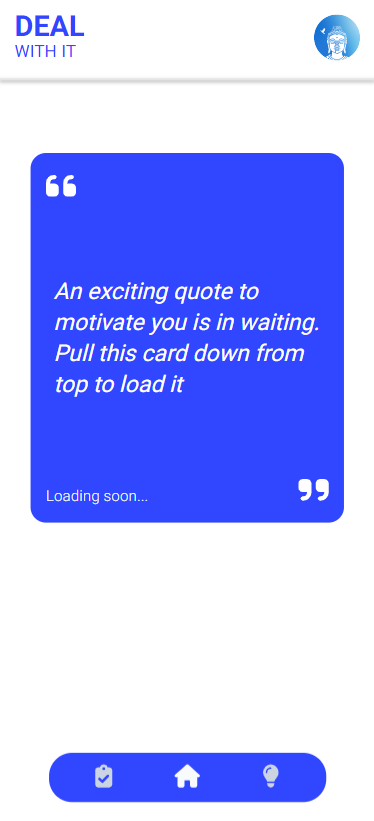
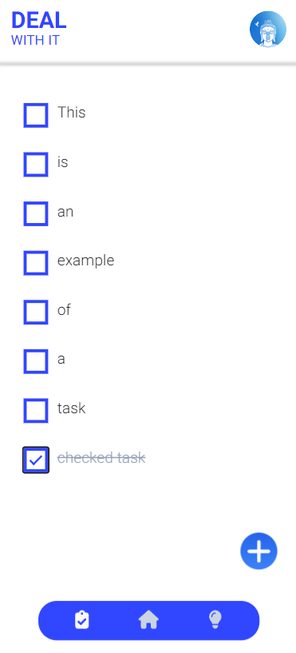
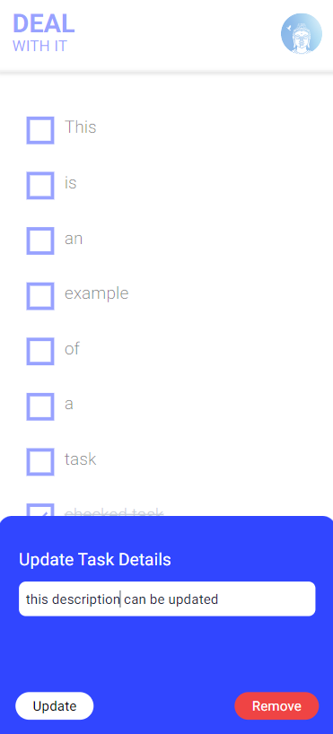
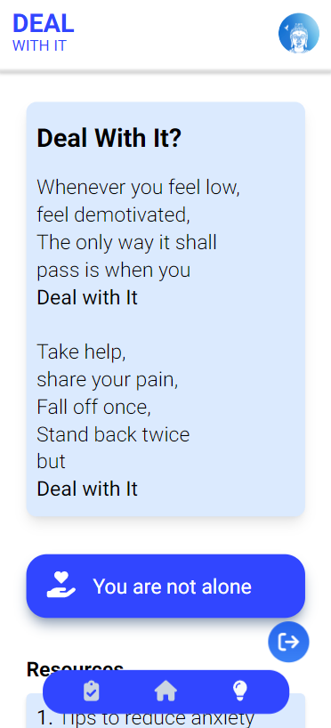

# Introduction
## <b>Deal With It </b> <br>
An anxiety reducer app - built with an aim to help uplift your mood and focus on what's important.

## Key Features
1. <b>A random quote</b> -from a vast library to cheer you, on the homepage.

2. <b>An in-built task manager</b> app - so that you can keep a track of your objectives, allowing all the CRUD operations

3. <b> Resources </b> - access to tons of different resources whenever you need them. 

4. <b> Blogs </b> - monthly updated blog from the founder's desk

## Deployment
Go **checkout the project** from your mobile phones by clicking [here](https://dealwithit.vercel.app/)  

**Credentials**
- username - test
- password - test@123

<br>

# Installation
Steps to run the project locally after cloning the repository <br>
1. Installing dependencies
```shell
npm i
```

2. Running the app
```sh
npm run start
```

3. To run the prodcution build
```sh
serve -s build
```

Now the app will start working on the localhost:3000

<br>

# Project Snaps
<br>
(_Landing screen of Deal with It_)
<br>
<br>

<br>
( _it shows the home page quote as mentioned earlier_ )
<br>
<br>

<br>
(_A glimpse of all the tasks the user has created_)
<br>
<br>

<br>
(_A task once created can be updated as well as removed too_)
<br>
<br>

<br>
(_A glimpse of the resources page_)

<br>

# Tech Stack
## 1. **Frontend**
    - React - v18  
    - Tailwind CSS
## 2. **Backend**
    - Hygraph - headless CMS for React
    - APINinjas - for fetching random quotes

<br>

# Thanks
if you liked the project, consider starring it and saving it to your repository. I had a lot of fun while building this and do hope that you like it. Happy Building :)

